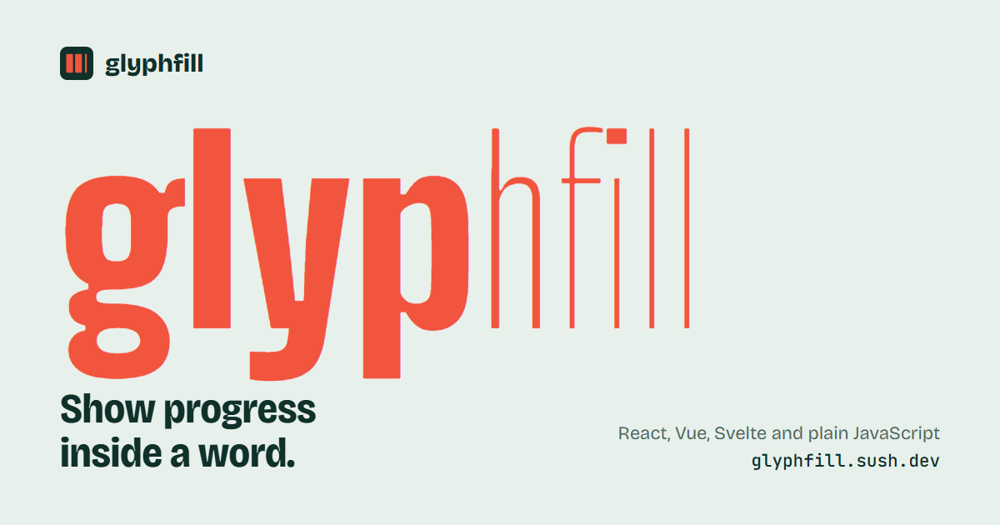

<p align="center">
  <a href="https://glyphfill.sush.dev">
    
  </a>
</p>

<p align="center">
  <a href="https://glyphfill.sush.dev"><b>Website and playground</b></a> ·
  <a href="https://www.npmjs.com/package/glyphfill">npm</a> ·
  <a href="https://sush.dev">sush.dev</a>
</p>

# glyphfill

Show progress inside a word. As a task completes, letters get heavier or fill with ink. Components for React, Vue and Svelte, plus plain JavaScript. See [the package README](packages/glyphfill/README.md) for the API.

This repo is a pnpm + Turborepo monorepo:

| Path                 | What it is                                                                |
| -------------------- | ------------------------------------------------------------------------- |
| `packages/glyphfill` | The npm package: core, `glyphfill/react`, `glyphfill/vue`, `glyphfill/svelte` |
| `apps/web`           | Next.js site and playground, deployed to Vercel at glyphfill.sush.dev     |

## Develop

```sh
pnpm install
pnpm dev          # watches the package and runs the site at http://localhost:3000
```

| Command          | Does                                                     |
| ---------------- | -------------------------------------------------------- |
| `pnpm build`     | Builds the package, then the site                        |
| `pnpm test`      | Runs the package's unit tests (Vitest)                   |
| `pnpm typecheck` | Type-checks everything                                   |
| `pnpm lint`      | Lints and checks formatting (Biome). `pnpm format` fixes |
| `pnpm check`     | Checks the published package shape (publint, attw)       |

CI runs all of these on every push and pull request (`.github/workflows/ci.yml`).

## License

MIT © [Sushil Buragute](https://sush.dev)
